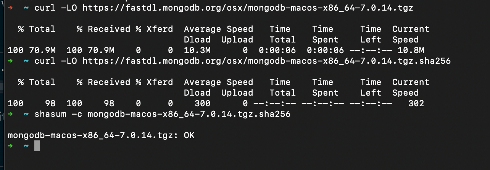
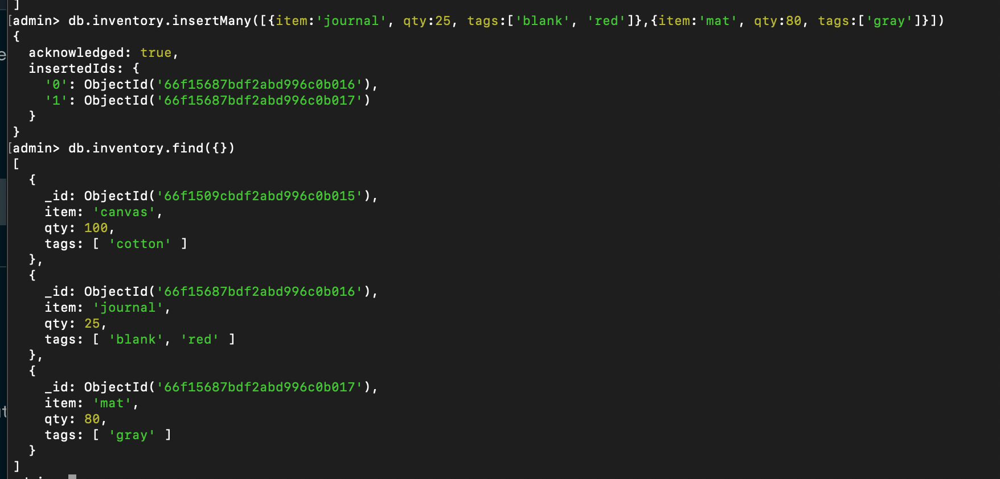
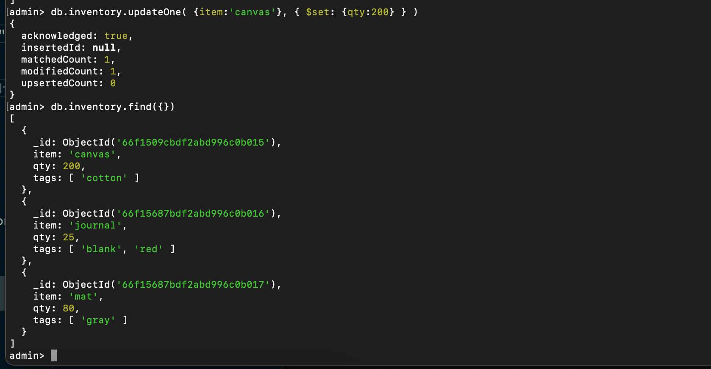
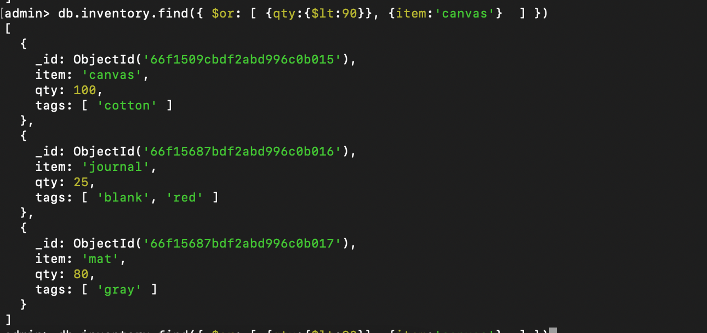
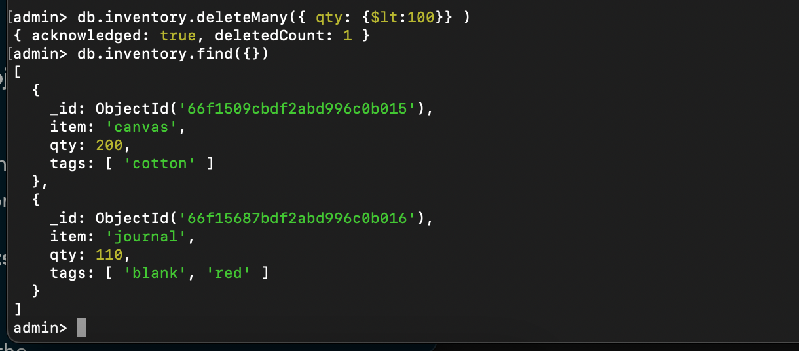
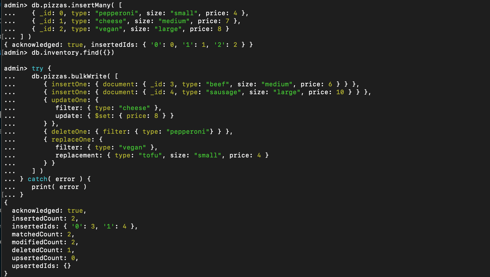
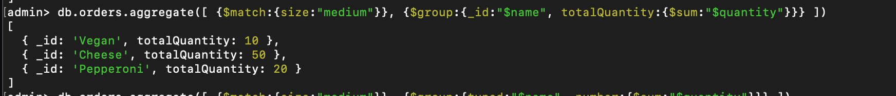
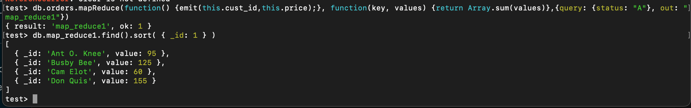

# Expass 5
_**Thea Jenny E. Kolnes**_

CRUD operations in MongoDB.

## Setup
Validate package

Connect to database
* `brew services start mongodb-community@7.0`
* `mongosh`

### Technical problems that you encountered during installation and use of MongoDB and how you resolved
Had none.

## Experiment 1, CRUD operations

* Insert
  * 
* Update
  * 
* Query
  * 
* Delete
  * 
* Bulk write
  * 

## Experiment 2, Aggregation
* Aggregation
  * 
* Map-Reduce
  * 

### Reason about why your implemented Map-reduce operation in Experiment 2 is useful and interpret the collection obtained.
The implementation of map-reduce is useful to avoid unnecessary duplicates or redundant data. The implementations makes every row unique and merges those who give information to the same thing. As a result, the data that is displayed is easier to understand.

The collection I received from the map-reduce in the example is the different customers ids and their total price. The collection is nice when I only care about how much each customer used in total without having to do math to find a customer's total.

### Any pending issues with this assignment which you did not manage to solve
None.