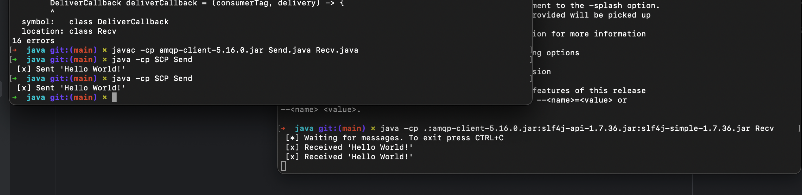
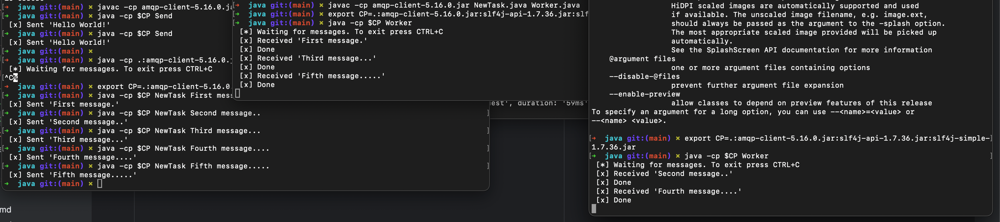
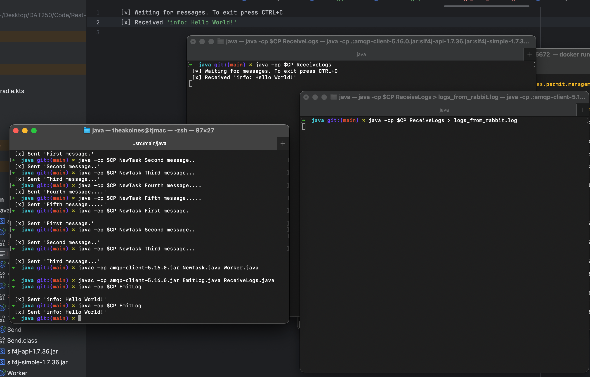

# Expass 6
_**Thea Jenny E. Kolnes**_

## Technical problems that you encountered during the completion of the tutorial
Struggled a bit with setting up docker and the rabbitQM imports. Solved it eventually after understanding how it was connected. In the end I only added the `implementation("com.rabbitmq:amqp-client:5.22.0")
` in `build.gradle.kts` file, then rebuilt the gradle.

## A link to your code for experiments 1-4 above
### Experiment 1, Docker
* Already had `Docker Desktop` installed.
* Started docker with `docker run -it --rm --name rabbitmq -p 5672:5672 -p 15672:15672 rabbitmq:4.0-management`

### Experiment 2, Hello World
* Created [Send.java](rabbit/src/main/java/Send.java) and [Recv.java](rabbit/src/main/java/Recv.java)
* Compiled files `javac -cp amqp-client-5.16.0.jar Recv.java Send.java`
* Created variable in terminal `$CP` from `export CP=.:amqp-client-5.16.0.jar:slf4j-api-1.7.36.jar:slf4j-simple-1.7.36.jar`
* Ran `Recv` with `java -cp $CP Recv`
* Then `Send` with `java -cp $CP Send`
* Received `Hello World` from program.


### Experiment 3, Working Queues
* Created [NewTask.java](rabbit/src/main/java/NewTask.java) and [Worker.java](rabbit/src/main/java/Worker.java)
* Compiled both files `javac -cp amqp-client-5.16.0.jar NewTask.java Worker.java`
* Started two worker nodes (consumers) in two terminals `java -cp $CP Worker`
* Ran multiple instances of the producer node
  ```shell
    java -cp $CP NewTask First message.
    java -cp $CP NewTask Second message..
    java -cp $CP NewTask Third message...
    java -cp $CP NewTask Fourth message....
    java -cp $CP NewTask Fifth message.....
    ```
* Received messages in the two terminals interchangeably every other run.


Added durability
* Added this in both producer and consumer nodes (`NewTask.java` and `Worker.java`).
  ```java
    boolean durable = true;
    channel.queueDeclare(QUEUE_NAME, durable, false, false, null);
    ```
* Added in `Worker.java`
  ```java
  int prefetchCount = 1;
  channel.basicQos(prefetchCount);
  ```

### Experiment 4, Publish/Subscribe
* Created [EmitLog.java](rabbit/src/main/java/EmitLog.java) and [ReceiveLogs.java](rabbit/src/main/java/ReceiveLogs.java)
* Compiled both files `javac -cp amqp-client-5.16.0.jar EmitLog.java ReceiveLogs.java`
* Started `ReceiveLogs.java` that received output in file [logs_from_rabbit.log](rabbit/src/main/java/logs_from_rabbit.log)
* Ran `EmitLog.java` with `java -cp $CP EmitLog`


## Any pending issues with this assignment which you did not manage to solve
* None
