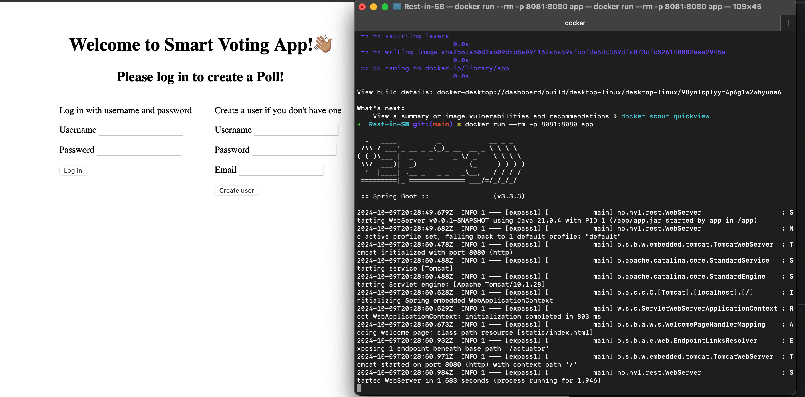

# Expass 7
_**Thea Jenny E. Kolnes**_

## Technical problems that you encountered during the completion of the tutorial
* Struggling a bit to connect to the postgreSQL database. In the end it worked somehow, though I didn't really figure out what was wrong in the beginning. It was probably running with wrong parameters or not using the correct username/password. 
## Tasks
### Using a Dockerized application: PostgreSQL
* Downloaded docker image of postgreSQL `docker pull postgres`
* Started postgreSQL on docker `docker run -p 5432:5432 -e POSTGRES_USER=tjekol -e POSTGRES_PASSWORD=pass -e POSTGRES_DB=jpadb -d --name my-postgres --rm postgres postgres`
* Updated `persistence.xml` file and `build.gradle.kts`
  * ```xml
    <property name="hibernate.dialect" value="org.hibernate.dialect.PostgreSQLDialect"/>
    <property name="hibernate.connection.driver_class" value="org.postgresql.Driver"/>
    <property name="hibernate.connection.url" value="jdbc:postgresql://127.0.0.1:5432/jpadb"/>
    <property name="hibernate.connection.username" value="tjekol"/>
    <property name="hibernate.connection.password" value="pass"/>
    
    <property name="jakarta.persistence.schema-generation.scripts.action" value="drop-and-create"/>
    <property name="jakarta.persistence.schema-generation.scripts.create-target" value="schema.up.sql"/>
    <property name="jakarta.persistence.schema-generation.scripts.drop-target" value="schema.down.sql"/>
    ```
  * ```kotlin
    implementation("org.postgresql:postgresql:42.7.4")
    ```
* Was able to connect database

* Got `schema.up.sql` and `schema.down.sql`
* Runs the sql commands in the SQL-client to create tables.
* Tests pass


### Building you own dockerized application
* Created the [Dockerfile](Dockerfile)
* Has tested and it works.
* Does not run on root and has a multi-stage build.




## Any pending issues with this assignment which you did not manage to solve
None